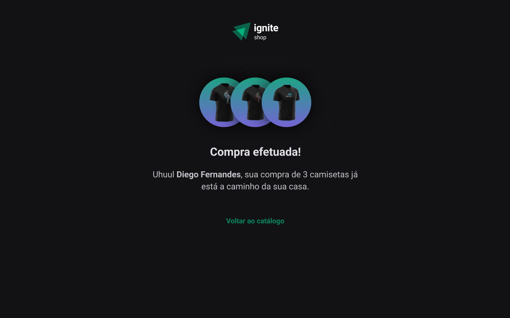

<h1 align="center">GitHub Blog</h1>

<h2>Home</h2>

<h2>Product Details</h2>

<h2>Cart Open</h2>

<h2>Success Page</h2>

## :memo: Description
* A store to sell t-shirts
## :books: Functions
* In this challenge, some extra features were added to the project that was developed in module 4. A cart was implemented in the project that uses Stripe API data, to search for existing items, and control, through the application, the number of items that the person wants to buy, with the option to add and remove items before proceeding to checkout.

## :wrench: technologies used
* Next Js
* TypeScript
* ReactJs
* Phosphoricons
* Stiches
* useContext
* Radix
     
## :rocket: Deploy
Download the files and run the following command in the terminal: "npm install", to download the project's dependencies

## :handshake: Collaborators
<table>
  <tr>
    <td align="center">
      <a href="http://github.com/oducoelho">
         
        
          <b>oducoelho</b>
        
      </a>
    </td>
  </tr>
</table>
